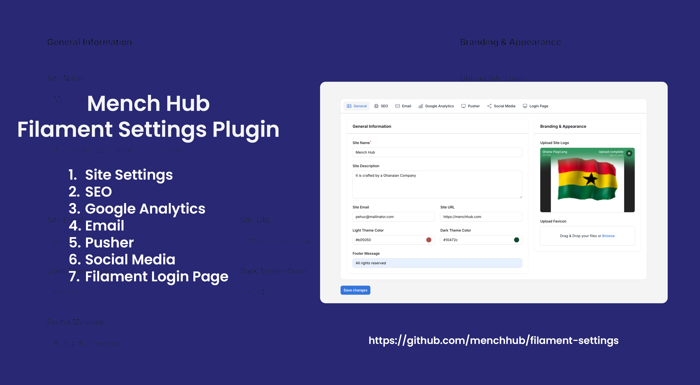

# **Mench Hub Filament Settings Package**
A Filament v3 package that integrates **Spatie Laravel Settings** with Filament Admin Panel, allowing you to manage application settings easily.

---

## 📸 Preview



---
## **📥 Installation**
Install the package via Composer:
```sh
composer require menchhub/filament-settings
```

Publish the configuration file:
```sh
php artisan vendor:publish --tag=filament-settings-config
```

Run the migration to create the settings table:
```sh
php artisan migrate
```

---

## **⚙️ Configuration**
After publishing the config file, you can find it in:  
📌 **`config/filament-settings.php`**

### **Example Config**
```php
return [
    /*
     * Available Filament settings pages to register.
     * These should extend `Filament\Pages\Page`.
     */
    'pages' => [
        \Menchhub\FilamentSettings\Filament\Pages\SiteSettingsPage::class,
    ],

    /*
     * Register the settings classes for Spatie Settings.
     * These should extend `Spatie\LaravelSettings\Settings`.
     */
    'settings' => [
        \Menchhub\FilamentSettings\Settings\SiteSettings::class,
    ],
];
```

### **🔹 How It Works**
- The package **automatically registers** settings pages defined in `config/filament-settings.php`.
- Any new settings pages added here **will be dynamically loaded** in Filament.

---

## **🖌️ Customizing Plugin Appearance**
You can customize how the settings plugin appears in the **Filament navigation menu**.

📌 **File Path:** `app/Providers/Filament/AdminPanelProvider.php`

### **🔹 Available Customization Options**
```php
MenchFilamentSettingsPlugin::make()
    ->setSort(3) // Sort order in menu (lower = higher)
    ->setIcon('heroicon-o-cog') // Heroicons name
    ->setNavigationGroup('Settings') // Group inside the sidebar
    ->setTitle('Main Settings') // Title of the page
    ->setNavigationLabel('Mench Settings'); // Label in the sidebar
```
---


✅ Now Filament **automatically loads** the new settings!

---

## **✨ Features**
✅ **Fully integrates with Filament v3**  
✅ **Uses Spatie Laravel Settings for persistence**  
✅ **Automatically registers new settings pages**  
✅ **Easily configurable via `config/filament-settings.php`**

---

## **💡 Contributing**
Feel free to submit **issues, feature requests, or pull requests** to improve the package! 🚀

---

## **📄 License**
This package is open-sourced software licensed under the **MIT license**.


---
## 🏢 About Mench Hub
This package is maintained by [Menchhub](https://menchhub.com).  
For support, visit our [website](https://menchhub.com) or contact us at [support@menchhub.com](mailto:support@menchhub.com).

